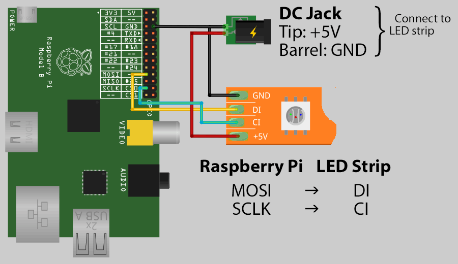

# sun

##dependencies:

[PixelPi](https://github.com/scottjgibson/PixelPi)

[AndyPi](http://andypi.co.uk/?page_id=721)

##setup:

0. prepare the raspberry hardware

	1. plug any WS2801 rgbled, as the following img shows, to the raspberry
	
	

1. Install raspbian-wheezy [official link](https://www.raspberrypi.org/documentation/installation/installing-images/)
	1. prepare the sd card on your computer:
		1. first download the [img](https://downloads.raspberrypi.org/raspbian/images/raspbian-2015-05-07/2015-05-05-raspbian-wheezy.zip) (in my case it was the 2015-05-05 build) on you computer
		2. insert the sd card into your computer
		3. get the sd-card mount number (attention: be suer what number otherwise data can get lost)
		
				diskutil list
			
		4. unmount the sd card
			
				diskutil unmountDisk /dev/disk<disk#>
			
		5. disk dump (copy) the image to the sd card (on mac you can see the process with ctrl+T) 
		
				sudo dd bs=1m if=/put/the/path/of/your/downloaded/img.img of=/dev/rdisk<disk#>
				
			this step can take a while(depending on the sd card speed up to 30min)
	
	2. first start of the raspberry, with external **keyboard, monitor and ethernetcable**
			
		1. plug in keyboard, monitor and ethernetcable to the raspberry
		
		2. put in the sd card to the raspberry
		
		3. turn on by plugging in the micro USB to the rasberry
		
		4. after the boot up the configuration tool should appear (if you later want to change things in hear you can get it via **sudo raspi-config**)
			
			1. select "1. Expand Filesystem"
			
			2. select "2. Change User Password" and set a new password for the pi user (pay attention the keyboard layout ist us)
			
			3. select "3. Enable Boot to Desktop/Scratch"
				
				1. select the first one "Console Text console..."
			
			4. select "4. Internationalisation Options"				
				1. configure the I2 (important for the alarm clock)
				
				2. you can configure I1 and I3 but you don't have to
				
			5. select "8. Advanced Options"
			
				1. select "A3 Memory Split" and set it to 16 
				
				2. select "A4 SSH" and enable it
				
				3. select "A6 SPI" and select **yes** and again **yes** to loading it by default 
				
				4. select "A9 Audio" and select "1 Force 3.5mm..."
				
			6. exit the configuration tool with exit key. now your logged in as pi user. 
			
				1. get the ip of the raspberry (in the second line is the raspberry IP address)
					
						ifconfig
				
				2. remember this IP address and reboot the raspberry. remove the monitor and keyboard from the raspberry
					
						sudo reboot
						
			7. back on your computer connect via ssh to the raspberry use the remembered IP address 
				
					ssh pi@<xxx.xxx.xxx.xxx>	
					
				yes the RSA dialog and use your computer password to accept
			
			8. Install the needed resources
			
				1. install python (for PixelPi)
				
						sudo apt-get update
						sudo apt-get install python-dev
						sudo apt-get install python-pip
						sudo pip install spidev
						
				2. (**additional** if you want to develop the front end) install grunt
				
						
			
			9. get the sun repository
			
					git clone git://github.com/TobiasSchaeuble/sun.git
					git clone git://github.com/scottjgibson/PixelPi.git
					
			10. 		
				